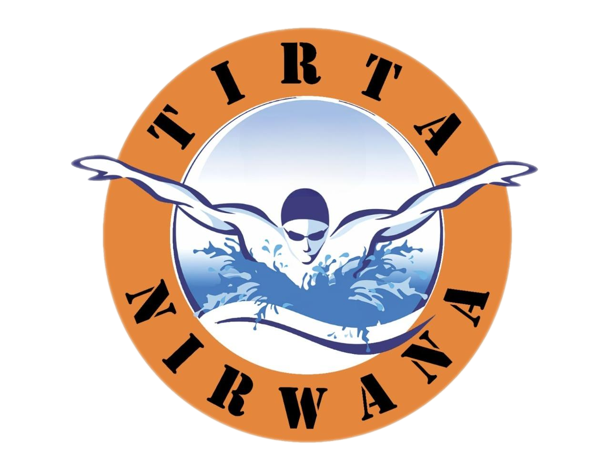

<p align="center">
  
</p>

<h1 align="center">Tirta Nirwana — Company Profile & CMS</h1>

<p align="center">
  Website profil perusahaan sekolah renang <b>Tirta Nirwana</b> (Surabaya).<br>
  Halaman publik modern (Inertia + React + TypeScript) dengan panel admin (Filament) untuk kelola konten.
</p>

---

## ✨ Fitur

- **Halaman publik**: Beranda, Layanan (+ detail), Blog (+ detail, filter kategori), Tentang Kami, Tim, FAQ, Kontak (form → email).
- **Panel admin** di `/admin` (Filament) — CRUD untuk semua konten yang tampil di publik.
- **Dark mode** (pre-paint, no flash), responsif, animasi hormati `prefers-reduced-motion`.
- **Design system** berbasis token dari warna logo (orange + navy + water blue), kontras WCAG AA.

## 🧱 Stack

| Layer | Teknologi |
|---|---|
| Backend | PHP `^8.1`, Laravel `^10.10` |
| Admin | Filament `^3.3` |
| Frontend publik | Inertia.js `^2.0` + React `19` + TypeScript |
| Styling | Tailwind `^3.1` + shadcn/ui (Radix + CVA) + lucide-react |
| Build | Vite `^5` + `@vitejs/plugin-react` |
| Auth | Laravel Breeze + Sanctum |

> Halaman publik = React (Inertia). Panel admin = Filament (Livewire). Keduanya baca **model yang sama**; admin mengisi, publik menampilkan.

## 🎨 Brand

Palet diambil dari logo Tirta Nirwana dan didefinisikan sebagai token HSL di `resources/css/app.css`:

| Token | Peran | Sumber di logo |
|---|---|---|
| `--primary` | tombol/aksi (orange) | cincin oranye |
| `--foreground` | teks/heading (navy) | perenang & tulisan |
| `--accent` | sorotan (water blue) | air/percikan |

Ubah warna cukup di blok `:root` / `.dark` — seluruh komponen ikut otomatis.

## 🚀 Setup

```bash
# 1. Dependencies
composer install
npm install

# 2. Environment
cp .env.example .env
php artisan key:generate

# 3. Database (set kredensial di .env dulu)
php artisan migrate

# 4. Storage symlink (untuk gambar yang di-upload admin)
php artisan storage:link
```

Buat user admin (akses `/admin`):

```bash
php artisan make:filament-user
```

## 🛠️ Development

Jalankan **dua** proses:

```bash
npm run dev        # Vite dev server (HMR untuk React/CSS)
php artisan serve  # atau biarkan Laragon yang serve
```

Build produksi:

```bash
npm run build
```

## 📂 Struktur

```
app/
  Http/Controllers/PageController.php   # render semua halaman Inertia
  Http/Controllers/ContactController.php# submit form kontak → email
  Models/                              # AboutUs, Blogs, Categories, FAQ, Service, Teams, User
  Filament/Resources/                 # CRUD admin per model
resources/
  js/Pages/                           # halaman React (Home, Services, Blogs, ...)
  js/components/                       # Navbar, Footer, kartu, ui/ (shadcn)
  css/app.css                         # token design system
  views/app.blade.php                 # root template Inertia
routes/web.php                        # rute publik → PageController
routes/auth.php                       # rute Breeze
public/front/                         # aset statis (logo, gambar)
```

Alur menambah section terkelola: **migration → model → Filament resource → halaman React**.

## 🩺 Troubleshooting

| Gejala | Sebab | Solusi |
|---|---|---|
| Halaman **blank** | `public/hot` basi (dev server mati) | hapus `public/hot`, atau jalankan `npm run dev` |
| `@vitejs/plugin-react can't detect preamble` | `app.blade.php` kurang `@viteReactRefresh` | pastikan ada **sebelum** `@vite(...)` |
| `Cannot read properties of null (reading 'component')` | protokol Inertia tak cocok (client baca `<script data-page>`) | `config/inertia.php` → `use_script_element_for_initial_page => true` |
| Section publik kosong | DB belum ada data | isi konten via `/admin` |
| Gambar admin 404 | belum ada symlink | `php artisan storage:link` |

## 🧪 Quality

```bash
php artisan test      # PHPUnit
vendor/bin/pint       # format PHP
npx tsc --noEmit      # type-check TS
```

## 📄 Lisensi

Proprietary — internal Tirta Nirwana. Framework Laravel di bawah [MIT](https://opensource.org/licenses/MIT).
